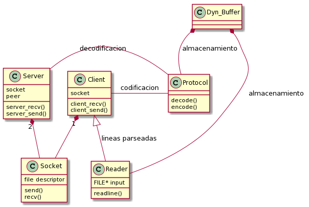

# Trabajo Practico N°1

Trabajo practico N°1 de Taller de Programación 1(75.42)

*Alumno:* Julián Crespo

*Padron:* 100490

*Repositiorio:* https://github.com/komod0/tp1

---

### Diseño

El programa cuenta con varias entidades y estructuras auxiliares que sirvieron para poder separar responsabilidades, modularizar y obtener una interfaz relativamente amigable.
Se muestra un diagrama (no exhaustivo) de las entidades presentes.

En principio el cliente y el servidor no tienen contacto directo entre ellos, toda comunicación pasa por mediante del protocolo para tareas de codificación/decodificación de los mensajes y por los sockets para realizar los correspondientes send y recv.

Las entidades client y server funcionan parcialmente como wrappers de las llamadas a sockets que le corresponden para comunicarse, pero, adaptandose a las especificaciones del protocolo, es decir por ejemplo, `server_recv_call` recibe un buffer del tipo `char*` y llama a `socket_recv`  de forma de recibir el mensaje por partes(recibe primero 16 bytes, analiza las descripciones y en base a eso continua recibiendo el mensaje).

Como se puede observar tanto el cliente como el servidor cuentan con sockets, en el caso de server cuenta con dos sockets asociados, uno que vendría a cumplir el rol del "aceptador" y el otro que seria el socket mismo por donde ocurre la comunicación, el _peer_.

El cliente es quien se encarga de recibir la entrada por stdint o mediante un archivo, una vez seleccionado el origen de la entrada se procede a leer y parsear cada una de las llamadas una linea a la vez, para esto se ayuda de un buffer fijo de 32 bytes, por el cual se van leyendo de a una las lineas, 

Se adjunta un diagrama de secuencia para esquematizar como es que se procesa envia y se recibe la respuesta a una llamada de a una linea a la vez.

### 

### Dificultades:

La parte del trabajo de leer la entrada de a una linea usando un buffer fijo de 32 bytes fue la que resulto de mayor dificultad y consumidora de tiempo a la hora de  resolver el TP, ya que para poder leer el archivo de a una linea con el buffer fijo se debió de usar gran cantidad de variables indicadoras y de punteros ademas de contemplar muchos casos bordes posibles como por ejemplo que dentro del buffer tenga mas de una linea o que no haya un salto de linea dentro del buffer, en cuyo caso se debe volver a leer 32 bytes hasta encontrar uno, y luego unir las partes en una sola linea.

### Faltantes:

Debido a un mal aprovechamiento del tiempo y una subestimación del tiempo requerido para realizar el trabajo no se pudo completar del todo el mismo, se logro terminar en su mayoría el trabajo pero hubo algunos faltantes como la parte del servidor que envia la respuesta al cliente y la parte del cliente que la recibe, ademas falto documentar las funciones y completar el informe.
